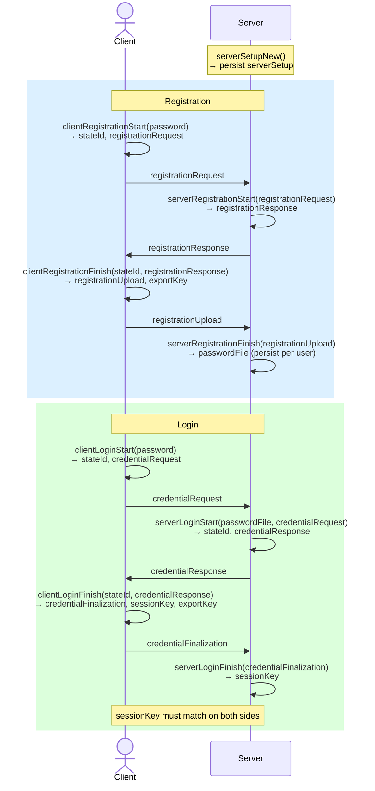

# flutter_opaque

Flutter plugin that exposes the [OPAQUE](https://eprint.iacr.org/2018/163.pdf) password-authenticated key exchange (PAKE) protocol via a Rust binding built with [flutter_rust_bridge](https://github.com/fzyzcjy/flutter_rust_bridge).

OPAQUE never sends the password (or a hash of it) to the server. Instead, both sides collaboratively derive a shared session key using a cryptographic protocol — the server learns nothing about the raw password.

## Library versions

| Crate | Version |
|---|---|
| [opaque-ke](https://crates.io/crates/opaque-ke) | 4.0.1 |
| [flutter_rust_bridge](https://pub.dev/packages/flutter_rust_bridge) | 2.12.0 |
| argon2 | 0.5.3 |
| sha2 | 0.10.9 |

## Cipher suite

| Parameter | Value |
|---|---|
| OPRF group | Ristretto255 |
| Key exchange | TripleDH (Ristretto255 + SHA-512) |
| Key stretching (KSF) | Argon2 |

## Getting started

```yaml
# pubspec.yaml
dependencies:
  flutter_opaque:
    path: ../flutter_opaque   # adjust to your layout
```

Initialize the Rust library once at app startup:

```dart
import 'package:flutter_opaque/flutter_opaque.dart';

Future<void> main() async {
  await RustLib.init();
  runApp(const MyApp());
}
```

## Protocol overview

OPAQUE has two flows — **registration** and **login** — each consisting of four steps that alternate between client and server.



## Usage

### Server setup

Generate once and store securely (changing it invalidates all registered users):

```dart
final serverSetupBytes = await serverSetupNew();
// save serverSetupBytes to secure server storage
```

### Registration

```dart
import 'dart:convert';
import 'package:flutter_opaque/flutter_opaque.dart';

final username = utf8.encode('alice');
final password = utf8.encode('correct horse battery staple');

// Step 1: client
final step1 = await clientRegistrationStart(password: password);

// Step 2: server — send step1.registrationRequest over the network
final regResponse = await serverRegistrationStart(
  serverSetup: serverSetupBytes,
  registrationRequest: step1.registrationRequest,
  credentialIdentifier: username,
);

// Step 3: client — send regResponse from server
final step3 = await clientRegistrationFinish(
  stateId: step1.stateId,
  password: password,
  registrationResponse: regResponse,
);
// step3.exportKey can be used to derive a local encryption key

// Step 4: server — send step3.registrationUpload from client; persist the result
final passwordFile = await serverRegistrationFinish(
  registrationUpload: step3.registrationUpload,
);
// store passwordFile in DB, keyed by username
```

### Login

```dart
// Step 1: client
final login1 = await clientLoginStart(password: password);

// Step 2: server — send login1.credentialRequest over the network
final srvLogin = await serverLoginStart(
  serverSetup: serverSetupBytes,
  passwordFile: passwordFile,        // loaded from DB
  credentialRequest: login1.credentialRequest,
  credentialIdentifier: username,
);

// Step 3: client — send srvLogin.credentialResponse from server
// Throws if the password is wrong (client detects this immediately)
final login3 = await clientLoginFinish(
  stateId: login1.stateId,
  password: password,
  credentialResponse: srvLogin.credentialResponse,
);

// Step 4: server — send login3.credentialFinalization from client
final serverSessionKey = await serverLoginFinish(
  stateId: srvLogin.stateId,
  credentialFinalization: login3.credentialFinalization,
);

// Both session keys must match
assert(login3.sessionKey.toString() == serverSessionKey.toString());
```

## API reference

### Server setup

| Function | Description |
|---|---|
| `serverSetupNew()` | Generate a new server keypair + OPRF seed. Returns serialized bytes. |

### Registration

| Function | Description |
|---|---|
| `clientRegistrationStart({password})` | Step 1 (client). Returns `ClientRegistrationStartResult` with `stateId` and `registrationRequest`. |
| `serverRegistrationStart({serverSetup, registrationRequest, credentialIdentifier})` | Step 2 (server). Returns `registrationResponse` bytes. |
| `clientRegistrationFinish({stateId, password, registrationResponse})` | Step 3 (client). Returns `ClientRegistrationFinishResult` with `registrationUpload` and `exportKey`. |
| `serverRegistrationFinish({registrationUpload})` | Step 4 (server). Returns serialized `passwordFile` bytes to store. |

### Login

| Function | Description |
|---|---|
| `clientLoginStart({password})` | Step 1 (client). Returns `ClientLoginStartResult` with `stateId` and `credentialRequest`. |
| `serverLoginStart({serverSetup, passwordFile, credentialRequest, credentialIdentifier})` | Step 2 (server). Returns `ServerLoginStartResult` with `stateId` and `credentialResponse`. |
| `clientLoginFinish({stateId, password, credentialResponse})` | Step 3 (client). Returns `ClientLoginFinishResult` with `credentialFinalization`, `sessionKey`, and `exportKey`. Throws on wrong password. |
| `serverLoginFinish({stateId, credentialFinalization})` | Step 4 (server). Returns `sessionKey` bytes. |

## Deploying a production server

The server-side functions are included for testing. In production the server should be a separate Rust process that uses `opaque-ke` directly:

```toml
# server/Cargo.toml
[dependencies]
opaque-ke = { version = "4.0.1", features = ["argon2"] }
sha2 = { version = "0.10", default-features = false }
rand = { version = "0.8", features = ["getrandom"] }
```

The cipher suite in the server must be identical to the one used in this plugin:

```rust
struct DefaultCS;
impl CipherSuite for DefaultCS {
    type OprfCs      = opaque_ke::Ristretto255;
    type KeyExchange = opaque_ke::TripleDh<opaque_ke::Ristretto255, sha2::Sha512>;
    type Ksf         = argon2::Argon2<'static>;
}
```

## Important notes

- **ServerSetup must never change.** Regenerating it means all users must re-register.
- **Intermediate state stays in Rust memory.** `stateId` is a handle — not serializable across process restarts or multiple devices.
- **One `stateId` per attempt.** Each call to `clientRegistrationStart` / `clientLoginStart` creates new state. The state is consumed (dropped) after the corresponding `finish` call.
- **Wrong password → exception.** `clientLoginFinish` throws if the server's response was generated from a different password. The server cannot distinguish a wrong password from a network error at this point.
- **`exportKey` is deterministic per password.** It can be used to derive a device-local encryption key, but changes if the password changes.

## Building

Requires:
- Flutter SDK
- Rust toolchain (stable, 1.85+)
- `flutter_rust_bridge_codegen` (`cargo install flutter_rust_bridge_codegen`)

To regenerate Dart bindings after editing Rust code:

```sh
flutter_rust_bridge_codegen generate
```
